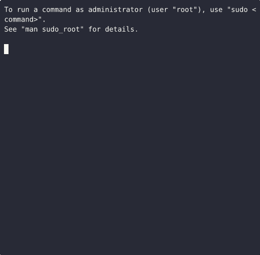

<p align="center">
  
</p>

<p align=center> A dead-simple CLI dotfile manager in bash</p>

<p align="center">
  <a href="https://github.com/DeprecatedLuar/ireallylovemydots/stargazers">
    
  </a>
  <a href="https://github.com/DeprecatedLuar/ireallylovemydots/blob/main/LICENSE">
    
  </a>

---

<p align="center">
  
</p>

## Cool Features

- **Dead-simple symlinks** - Configs link to `~/.config/dots` 
- **Auto-Git** - Your dotfiles are a git repo, auto-commits on changes
- **Dots are safe** - Files get moved to trash, never deleted
- **Batch operations** - There's also `-A` flag & argument chaining
- **Zero dependencies** - Literally just bash and git (and lOvE)
- **Profile system** - Manage multiple variants of a config

---

## Installation

```bash
curl -sSL https://raw.githubusercontent.com/DeprecatedLuar/ireallylovemydots/main/install.sh | bash
```

<details>
<summary>Manual Install</summary>

```bash
git clone https://github.com/DeprecatedLuar/ireallylovemydots.git
cd ireallylovemydots
./install.sh
```

</details>

---

<p align="center">
  
</p>


## Commands

| Command | Arguments         | Description                                      |
|---------|-------------------|--------------------------------------------------|
| setup   | `<user/repo>`     | Connect GitHub repo (creates if needed)          |
| snatch  | `<config>`        | Adopt config into dots repo and create symlink   |
| link    | `<config> ...`    | Create symlinks from dots repo to system         |
|         | `-A, --all`       | Link all configs (skip conflicts)                |
| unlink  | `<config>`        | Remove symlink (must point to dots)              |
|         | `-A, --all`       | Remove all symlinks pointing to dots             |
| eject   | `<config>`        | Move config out of dots repo back to system      |
| rm      | `<config>`        | Move config files/symlink to trash               |
| sync    |                   | Git pull and check for unpushed commits          |
| pull    |                   | Alias for sync                                   |
| push    |                   | Git push to remote                               |
| status  |                   | Show link status of all configs                  |

### Profile System (Multi-variant configs)

| Command              | Description                                      |
|----------------------|--------------------------------------------------|
| `<config> track`     | Mark files for profiling                         |
| `<config> init`      | Create new profile (copies from existing)        |
| `<config> list`      | Show available profiles                          |
| `<config> <profile>` | Switch to profile                                |
| `<config> rm`        | Delete profile                                   |
| `<config> untrack`   | Stop profiling files                             |

## Quick Start

```bash
# Connect to your GitHub dotfiles repo
dots setup yourusername/dotfiles

# Adopt your first config
dots snatch nvim

# Check what's linked
dots status

# Sync with remote
dots push

# On a new machine: install dots, then link everything
dots link -A
```

<details>
<summary>Full Workflow Example</summary>

```bash
# Start managing your configs
dots snatch nvim alacritty tmux

# See what's linked
dots status

# Push to your dotfiles repo
dots push

# On another machine:
# 1. Install irlmdots and run dots sync to clone your repo
# 2. Link all configs
dots link -A

# Stop managing a config (move it back out)
dots eject tmux

# Remove a symlink without moving the config
dots unlink nvim
```

</details> 

---


### Feel free to check some of my other projects I enjoyed makig:
https://github.com/DeprecatedLuar/better-curl-saul


---

<p align="center">
  <a href="https://github.com/DeprecatedLuar/better-curl-saul/issues">
    
  </a>
